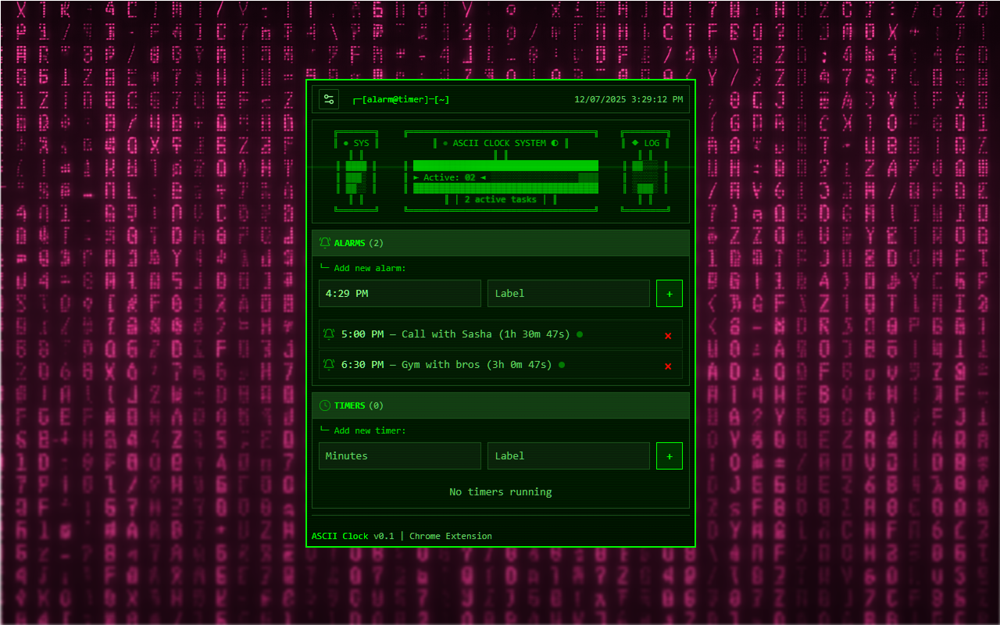

# ASCII Clock - Terminal Style Alarms & Timers 🖥️

A retro terminal-style browser extension that brings the nostalgic charm of command-line computing to your daily time management. Built with vanilla JavaScript and a focus on developer-friendly aesthetics.



## 🚀 Features

- **Terminal Aesthetic**: Authentic green-on-black terminal interface with ASCII art
- **Dual Functionality**: Both alarms (specific times) and timers (countdowns)
- **Multiple Themes**: 5 color schemes (Green, Blue, Amber, Pink, Red)
- **Smart Time Input**: Intuitive 12/24-hour format with intelligent input parsing
- **Performance Optimized**: Specially tuned for Firefox with reduced animation overhead
- **Offline First**: Works completely offline, no external dependencies
- **Privacy Focused**: All data stays local, no tracking or data collection

## 🎯 Perfect For

- **Pomodoro Technique** practitioners
- **Developers** who love terminal aesthetics
- **Study sessions** and work breaks
- **Retro computing** enthusiasts
- Anyone wanting **distraction-free** time management

## 📦 Installation

### Chrome Web Store
[Chrome -  ASCII Clock - Terminal Style Alarms & Timers](https://chromewebstore.google.com/detail/ascii-clock-terminal-styl/fakagkflpbbglcamkjohjanlcgeabhpa)

### Manual Installation (Developer Mode)
1. Download or clone this repository
2. Open Chrome and go to `chrome://extensions/`
3. Enable "Developer mode" in the top right
4. Click "Load unpacked" and select the project folder

### Firefox Add-ons
*[Coming Soon - Under Review]*

## 🛠️ Built With

- **Vanilla JavaScript**
- **Manifest V3**
- **CSS3 Animations**
- **Chrome Extension APIs** - Alarms, Storage

## 🧠 AI-Assisted Development

This project showcases modern AI-assisted development using structured prompt engineering and context management:

### Context Engineering Approach

**📁 Structured Context System**
```
context/
├── 1_ai_agent_rules.md          # Development guidelines & conventions
├── 2_feature_briefs/            # User stories & requirements
├── 3_base_prompts/              # Reusable prompt templates
└── 4_prp/                       # Project Requirement Prompts
```

**🎯 Key Techniques Used:**

1. **Modular Context Architecture**: Instead of massive prompts, I broke down context into focused, reusable modules that could be mixed and matched for different features.

2. **Project Requirement Prompts (PRPs)**: Each feature was planned using structured PRPs that included:
   - Clear success criteria
   - Implementation blueprints
   - Anti-patterns to avoid
   - Validation loops

3. **Iterative Refinement**: Built the extension incrementally, with each session focused on specific functionality (time input, performance optimization, security fixes).

4. **Cross-Browser Compatibility**: Used context to maintain Firefox-specific optimizations while preserving Chrome functionality.

### What Made This Collaboration Effective

**✅ Clear Constraints**: Specified exact UI requirements, performance targets, and code style preferences upfront

**✅ Context Preservation**: Maintained consistent context across multiple development sessions using structured documentation

**✅ Incremental Development**: Built features one at a time with clear acceptance criteria

**✅ Real-World Testing**: Continuously tested in both Chrome and Firefox

**✅ Security Focus**: Implemented proper XSS protection for Firefox store submission requirements

### AI Partnership Insights

This project demonstrates that AI coding assistants work best when:
- **Context is vast, structured and modular** rather than dumped in one vague prompt
- **Requirements are specific and testable** with clear success criteria
- **Domain expertise guides the AI** rather than expecting it to make architectural decisions
- **Iteration cycles are short** with immediate testing and feedback

The result is a production-ready browser extension that feels hand-crafted despite being largely AI-assisted.

## 🔧 Technical Highlights

- **Smart Time Parsing**: Handles intuitive inputs like `1010a` → `10:10 AM`
- **Performance Optimized**: Firefox-specific animations run 60% more efficiently
- **Security Hardened**: XSS-protected DOM manipulation for store approval
- **Cross-Browser**: Universal compatibility layer for Chrome/Firefox differences
- **Lightweight**: <250KB total size, minimal memory footprint

## 🎨 Terminal Aesthetics

- **Authentic CRT Effects**: Scanlines, terminal glow, and phosphor-style text
- **Matrix Rain Animation**: Configurable left-to-right digital rain
- **ASCII Art Headers**: Custom terminal-style branding
- **Retro Color Schemes**: Multiple vintage computing themes

## 📝 License

MIT License - feel free to use this code for your own projects!

## 🙏 Acknowledgments

- Built with **GitHub Copilot** and mostly **Claude 4** using structured prompt engineering
- Inspired by classic terminal computing and CRT aesthetics

---

*"Bringing the golden age of terminal computing to modern time management"* ⚡